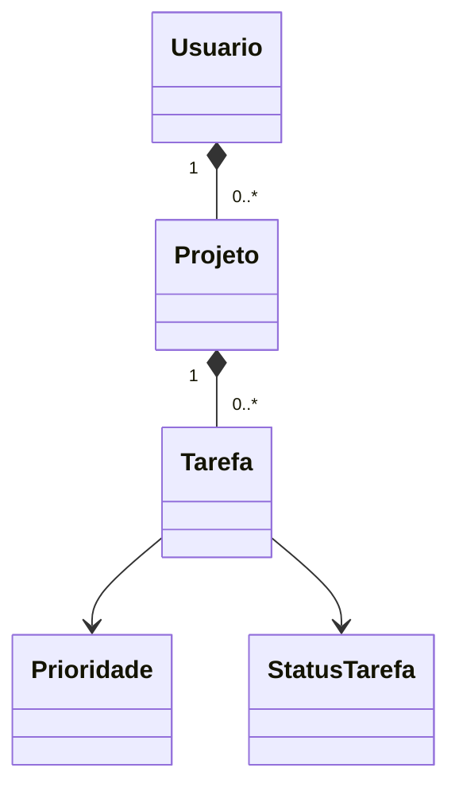

# Gerenciador Inteligente de Tarefas

Sistema de linha de comando desenvolvido para a atividade prática de Programação
Orientada a Objetos - Unidade 03. O projeto organiza usuários, projetos e tarefas,
acompanha o progresso e gera relatórios de produtividade.

## Objetivo

Aplicar Programação Orientada a Objetos em um sistema útil, modular e testável,
seguindo a estrutura sugerida na atividade. A solução usa somente a biblioteca
padrão do Python, portanto não exige instalação de pacotes externos.

## Funcionalidades

- Cadastro, listagem e remoção de usuários.
- Validação de ID e e-mail únicos.
- Senhas protegidas com hash PBKDF2 e salt aleatório.
- Cadastro, listagem e remoção de projetos por usuário.
- Cadastro, listagem e remoção de tarefas por projeto.
- Prioridades: Baixa, Média, Alta e Urgente.
- Status: Pendente, Em andamento e Concluída.
- Identificação de tarefas atrasadas.
- Cálculo do percentual concluído de cada projeto.
- Relatório de tarefas não concluídas por prioridade.
- Ranking de projetos por percentual de conclusão.
- Total de tarefas concluídas por usuário.
- Exportação dos relatórios para CSV e TXT.
- Interface interativa pelo terminal.
- Sete testes automatizados das regras principais.

## Conceitos de POO aplicados

| Conceito | Aplicação no projeto |
| --- | --- |
| Encapsulamento | Projetos, tarefas e hash da senha ficam em atributos internos controlados por métodos. |
| Abstração | `Exportador` define o contrato de geração de arquivos. |
| Herança | `ExportadorCSV` e `ExportadorTXT` herdam de `Exportador`. |
| Polimorfismo | A fachada trabalha com exportadores diferentes pelo mesmo método `exportar`. |
| Associação/composição | Um usuário possui projetos; um projeto possui tarefas. |
| Enumeração | `Prioridade` e `StatusTarefa` limitam estados válidos. |

## Tecnologias utilizadas

- Python 3.11 ou superior
- Biblioteca padrão: `datetime`, `enum`, `csv`, `hashlib`, `unittest`
- Git e GitHub
- Interface CLI (terminal)

## Estrutura do projeto

```text
gerenciador-inteligente-tarefas/
├── main.py                         # Inicia o menu interativo
├── exemplo_uso.py                  # Demonstração pronta
├── pyproject.toml                  # Metadados e versão do Python
├── README.md                       # Documentação
├── docs/
│   ├── diagrama-classes.md         # UML em Mermaid
│   └── folha-identificacao.pdf     # Folha exigida para envio
├── src/gerenciador_tarefas/
│   ├── cli.py                      # Interface de terminal
│   ├── excecoes.py                 # Erros de domínio
│   ├── exportacao.py               # CSV, TXT e polimorfismo
│   ├── modelos.py                  # Usuario, Projeto, Tarefa e enums
│   ├── relatorios.py               # Consultas de produtividade
│   └── servicos.py                 # Operações do sistema
└── tests/test_sistema.py           # Testes automatizados
```

## Como executar

Requisito: Python 3.11 ou superior.

```bash
git clone https://github.com/Daniel9011as/gerenciador-inteligente-tarefas.git
cd gerenciador-inteligente-tarefas
python main.py
```

No Windows, se o comando `python` não funcionar, use:

```powershell
py main.py
```

## Demonstração automática

Este comando cria um cenário de exemplo, calcula 50% de progresso e exporta os
relatórios para a pasta `relatorios`:

```bash
python exemplo_uso.py
```

Saída esperada:

```text
Projeto: Projeto de POO
Progresso: 50.0%
Pendências:
- [Urgente] Publicar no GitHub
```

## Executar os testes

```bash
python -m unittest discover -s tests -v
```

Resultado esperado: `Ran 7 tests` e `OK`.

## Regras de negócio

1. IDs devem ser inteiros positivos.
2. Não pode haver dois usuários com o mesmo ID ou e-mail.
3. O ID de um projeto é único dentro do usuário.
4. O ID de uma tarefa é único dentro do projeto.
5. Uma tarefa pertence a um único projeto.
6. Tarefa concluída não é considerada atrasada.
7. O progresso é `tarefas concluídas / total de tarefas × 100`.
8. Projeto sem tarefas possui 0% de progresso.

## Diagrama de classes

O diagrama completo está em [docs/diagrama-classes.md](docs/diagrama-classes.md).



## Publicação no GitHub

O projeto está publicado em:

<https://github.com/Daniel9011as/gerenciador-inteligente-tarefas>

Para enviar atualizações pelo terminal, execute dentro desta pasta:

```bash
git remote add origin https://github.com/Daniel9011as/gerenciador-inteligente-tarefas.git
git branch -M main
git push -u origin main
```

## Autor

Preencha antes do envio:

- Nome completo: **[SEU NOME COMPLETO]**
- Curso e período: **[SEU CURSO E PERÍODO]**
- Instituição: Anhanguera

## Status

Versão 1.0 concluída e validada com testes automatizados.
