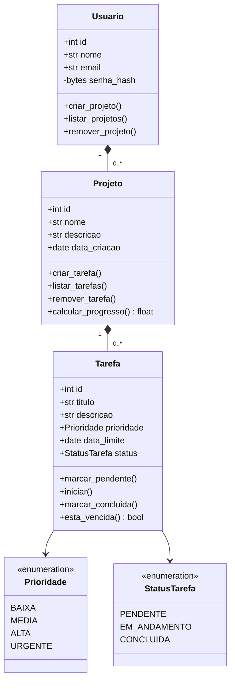

# Diagrama de classes

```mermaid
classDiagram
    class Usuario {
        +int id
        +str nome
        +str email
        -bytes senha_hash
        +criar_projeto()
        +listar_projetos()
        +remover_projeto()
    }
    class Projeto {
        +int id
        +str nome
        +str descricao
        +date data_criacao
        +criar_tarefa()
        +listar_tarefas()
        +remover_tarefa()
        +calcular_progresso() float
    }
    class Tarefa {
        +int id
        +str titulo
        +str descricao
        +Prioridade prioridade
        +date data_limite
        +StatusTarefa status
        +marcar_pendente()
        +iniciar()
        +marcar_concluida()
        +esta_vencida() bool
    }
    class Prioridade {
        <<enumeration>>
        BAIXA
        MEDIA
        ALTA
        URGENTE
    }
    class StatusTarefa {
        <<enumeration>>
        PENDENTE
        EM_ANDAMENTO
        CONCLUIDA
    }
    Usuario "1" *-- "0..*" Projeto
    Projeto "1" *-- "0..*" Tarefa
    Tarefa --> Prioridade
    Tarefa --> StatusTarefa
```

